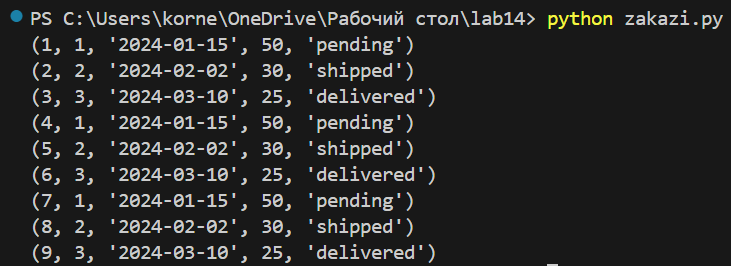
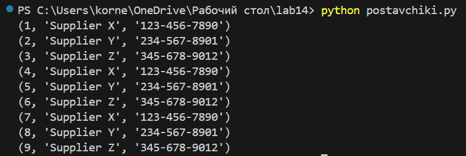
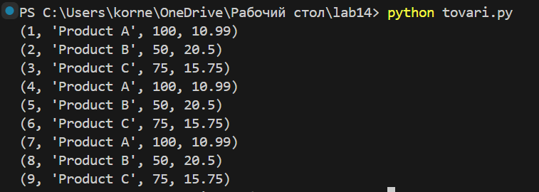

# Лабораторная работа №14
## Основы БД
### Сложность:Rare

1. Спроектируйте БД с использованием crow’s foot notation.
2. Создайте таблицы БД и заполните данными. Для генерации данных можно использовать сервис https://www.mockaroo.com/.
3. Напишите несколько запросов для выборки данных из всех таблиц.
4. Оформите отчёт в README.md. Отчёт должен содержать:
    + Условия задач
    + Описание проделанной работы
    + Скриншоты результатов
    + Ссылки на используемые материалы


Вариант 4
База данных складского учета:
+ Таблица Товары с информацией о товарах на складе, такой как наименование, количество и цена.
+ Таблица Поставщики с информацией о поставщиках товаров, например, название компании и контактная информация.
+ Таблица Заказы с информацией о заказах у поставщиков, такой как дата заказа, количество и статус.

Программый код основной программы:
```python
import sqlite3

# Создаем соединение с базой данных
conn = sqlite3.connect('warehouse.db')
cur = conn.cursor()

# Создаем таблицу товаров
cur.execute('''
CREATE TABLE IF NOT EXISTS tovari (
    id INTEGER PRIMARY KEY,
    name TEXT,
    quantity INTEGER,
    price REAL
)
''')

# Создаем таблицу поставщиков
cur.execute('''
CREATE TABLE IF NOT EXISTS postavchiki (
    id INTEGER PRIMARY KEY,
    company_name TEXT,
    contact_info TEXT
)
''')

# Создаем таблицу заказов
cur.execute('''
CREATE TABLE IF NOT EXISTS zakazi (
    id INTEGER PRIMARY KEY,
    supplier_id INTEGER,
    order_date DATE,
    quantity INTEGER,
    status TEXT,
    FOREIGN KEY (supplier_id) REFERENCES suppliers(id)
)
''')

# Заполняем таблицы данными
cur.execute('''
INSERT INTO tovari (name, quantity, price) VALUES
('Product A', 100, 10.99),
('Product B', 50, 20.50),
('Product C', 75, 15.75)
''')

cur.execute('''
INSERT INTO postavchiki (company_name, contact_info) VALUES
('Supplier X', '123-456-7890'),
('Supplier Y', '234-567-8901'),
('Supplier Z', '345-678-9012')
''')

cur.execute('''
INSERT INTO zakazi (supplier_id, order_date, quantity, status) VALUES
(1, '2024-01-15', 50, 'pending'),
(2, '2024-02-02', 30, 'shipped'),
(3, '2024-03-10', 25, 'delivered')
''')

# Сохраняем изменения и закрываем соединение
conn.commit()
conn.close()


# Выборка данных из таблицы заказов
conn = sqlite3.connect('warehouse.db')
cur = conn.cursor()

cur.execute('SELECT * FROM zakazi')
rows = cur.fetchall()

for row in rows:
    print(row)

conn.close()
```
Программы выборки товаров:
```python
import sqlite3

# Выборка данных из таблицы товаров
conn = sqlite3.connect('warehouse.db')
cur = conn.cursor()

cur.execute('SELECT * FROM tovari')
rows = cur.fetchall()

for row in rows:
    print(row)

conn.close()
```

Программа выборки поставщиков:
```python
import sqlite3

# Выборка данных из таблицы поставщиков
conn = sqlite3.connect('warehouse.db')
cur = conn.cursor()

cur.execute('SELECT * FROM postavchiki')
rows = cur.fetchall()

for row in rows:
    print(row)

conn.close()
```

Программа выборки заказов:
```python
import sqlite3
# Выборка данных из таблицы заказов
conn = sqlite3.connect('warehouse.db')
cur = conn.cursor()

cur.execute('SELECT * FROM zakazi')
rows = cur.fetchall()

for row in rows:
    print(row)

conn.close()
```

### Инструкция для БД.
1. Для запуска выбора чего-либо с начала запускаем основную программу `python lab14.py`.
2. В папке с данной программой появится файл `warehouse.db`, это и будет наша база данных.
3. Теперь можно запустить программу для выбора товаров, поставщиков или заказов и в терминаре будет итог программ.

### Результаты программ.

<p style="text-align: center;">Рис. 1. Результат программы выбора заказов.</p>


<p style="text-align: center;">Рис. 2. Результат программы выбора поставщиков.</p>


<p style="text-align: center;">Рис. 3. Результат программы выбора товаров.</p>

### Ссылки на используемые материалы.
https://habr.com/ru/articles/754400/

https://www.mockaroo.com/

https://youtu.be/K1C5JAo7cMU